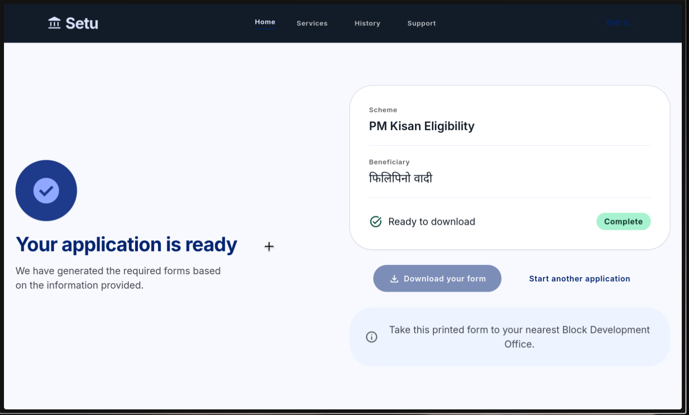

# 🚀 Setu
> The bridge between citizens and the government services they're entitled to — spoken in their own language.

---

## ⚡ Quick Start (judge edition)

Choose ONE of these paths:

| If you have... | Command |
|----------------|---------|
| **Docker** | `cp .env.example .env` → fill in keys → **`docker compose up`** |
| **Python + Node + `just`** | `cp .env.example .env` → fill in keys → **`just`** |
| **Python + Node + `make`** | `cp .env.example .env` → fill in keys → **`make`** |

All three do the same thing: install deps, run the pipeline test (proves Sarvam + Supabase work), and start both services. Full setup instructions below.

> ⚠️ **Before any of these work:** you need a Supabase project (apply `supabase/migrations/001-004`) and real API keys in `.env`. The README below walks through this once; after that, the one-command paths work every time.

---

## 📌 Problem & Domain

Hundreds of millions of Indians are entitled to government services — certificates, welfare scheme benefits, identity documents — but are functionally locked out of them by process friction: forms written in English or formal bureaucratic language, unclear document requirements, no way to resume an abandoned application, and no help available in the citizen's own spoken language. This friction disproportionately affects people with lower literacy or limited digital fluency, who often resort to paid middlemen for services that should be free and self-serve.

**Themes Selected (at least one):**
- [x] Human Experience & Productivity
- [ ] Climate & Sustainability Systems
- [ ] HealthTech & Bio Platforms
- [ ] Learning & Knowledge Systems
- [ ] Work, Finance & Digital Economy
- [ ] Infrastructure, Mobility & Smart Systems
- [ ] Trust, Identity & Security
- [ ] Media, Social & Interactive Platforms
- [x] Public Systems, Governance and Civic Tech
- [ ] Developer Tools & Software Infrastructure

---

## 🎯 Objective

Setu is a voice-first AI agent that lets a citizen speak naturally, in Hindi, Tamil, or Hinglish, about the government service they need — and be guided conversationally through the entire process, with progress tracked durably across days, ending in a real, submission-ready filled document.

- **Target users:** citizens who need a specific government certificate or scheme benefit and are more comfortable speaking than typing or reading complex forms — particularly those with limited English fluency or lower digital literacy.
- **The pain point:** navigating government paperwork is confusing, English-heavy, and offers no way to pick up where you left off if you get busy or overwhelmed mid-process.
- **The value:** Setu turns a multi-step bureaucratic process into a single spoken conversation that can be paused and resumed at any time, producing a completed, downloadable form at the end — no typing, no reading dense forms, no starting over.

---

## 🧠 Team & Approach

### Team Name:
`El3ctroKn1ght`

### Team Members:
- Evin Brijesh — [GitHub](https://github.com/evinbrijesh) / [LinkedIn](https://www.linkedin.com/in/evinbrijesh/) / Solo builder (full stack: voice pipeline, orchestration, frontend)

### Your Approach:
- **Why this problem:** bureaucratic friction is one of the most common, large-scale daily frustrations across India, and voice AI in Indic languages is finally mature enough to meaningfully address it.
- **Key challenges addressed:** building a genuinely durable, multi-day-resumable process without a component that can block for days (Render task runs cap at 24 hours and don't natively schedule future runs) — solved by keeping the durable record in Supabase and triggering a fresh, short-lived task run per user turn; and getting a reliable voice round-trip (browser mic → transcode → STT → TTS → playback) working end to end.
- **Pivots/iterations:** the architecture originally planned a hand-rolled Python/TypeScript state machine on Django + DRF or Supabase Edge Functions; this was deliberately replaced with real Render Workflow tasks once the dual-track requirement (Sarvam + Render Workflows) made that the stronger, more track-aligned choice.

*(Placeholder — add any additional breakthroughs or debugging war stories from the build here before submission.)*

---

## 🛠️ Tech Stack

### Core Technologies Used:
- **Frontend:** React + Vite
- **Backend:** FastAPI (voice bridge/audio service) + Render Workflows (durable task orchestration: intake, document collection, validation, form generation, notification)
- **Database:** Supabase (Postgres + Storage)
- **APIs:** Sarvam AI — Saaras v3 (speech-to-text), Bulbul v3 (text-to-speech), Sarvam-30B / Sarvam-105B (conversational reasoning and structured field extraction)
- **Hosting:** Render (Workflow service + web service)

### Additional Technologies Used (Optional):
- [x] AI / ML
- [ ] Web3 / Blockchain
- [ ] Cyber Security
- [x] Cloud

---

## 🏆 Sponsored Track

Setu is a dual-track submission:

- [x] **Sarvam Track** — Saaras v3, Bulbul v3, and Sarvam-30B/105B form the entire conversational core of the product: speech-to-text, structured field extraction from natural spoken language, and text-to-speech responses, across Hindi, Tamil, and Hinglish.

  > Every user utterance flows through Saaras v3 for transcription → Sarvam-30B for structured field extraction (with confidence/threshold-based re-asking when the LLM isn't sure) → Bulbul v3 for the spoken response. The model choice between 30B and 105B is deliberate: 30B handles single-field extraction for low latency, while 105B is wired in for complex, multi-field utterances that need stronger agentic reasoning.

- [x] **Render Workflows Track** — the entire multi-day, multi-stage government process (intake → document collection → validation → form generation → notification) is modeled as chained, independently retryable Render Workflow tasks, with Supabase holding the durable process state that outlives any single task run.

  > The entire application process is modeled as 5 independently retryable tasks visible in the Render Dashboard. Each user utterance triggers a fresh task run — the durable state lives in Supabase, not in a blocking 24-hour execution. The Dashboard shows real stage-by-stage progress: intake → document collection → validation → PDF generation → notification.

---

## ✨ Key Features

- ✅ Fully voice-driven intake and information collection — the core interaction is speaking, not typing or form-filling
- ✅ Multi-session resumability — stop mid-conversation and resume hours or days later without repeating information
- ✅ Automatic eligibility validation against scheme-specific rules
- ✅ Automatic generation of a real, downloadable, filled PDF at the end of the process
- ✅ Live progress visibility ("Step 3 of 5 complete") and a visible, config-driven form-preview panel
- ✅ Config-driven scheme support — 3 schemes shipped (PM Kisan, Caste Certificate, Income Certificate); adding a new government program requires only a JSON config file and a PDF template, zero new orchestration code
- ✅ Live Render Dashboard visibility showing real stage-by-stage progress of each task pipeline run
- ✅ Audio-reactive rings and live transcript display while speaking
- ✅ Language selector — Hindi, Tamil, and Hinglish supported
- ✅ Resumed-session indicator showing when a conversation is being picked up from a previous session
- ✅ Text input mode — send typed utterances without a microphone (useful for demos and testing)
- ✅ Demo PDF generation — hit `/api/form/mock-kisan-123` (or `mock-caste-123`, `mock-income-123`) to see a generated form without running the full pipeline

*(Add screenshots/GIFs of the mic interaction, live transcript, and form-preview panel here before submission.)*

### Screenshots

<!-- Replace captions below with accurate descriptions once you've verified which image is which -->

*Setu — voice-driven interface with live transcript and form preview*

.png)
*Multi-turn conversation collecting document details*

.png)
*Config-driven form preview showing collected fields*


*Render Dashboard showing stage-by-stage task pipeline progress*

---

## 📽️ Demo & Deliverables

- **Demo Video Link (Mandatory):** _[Paste link here]_
- **Deployment Link (Recommended):** _[Paste link here]_
- **Pitch Deck / PPT (Optional):** _[Paste link here]_

---

## ✅ Tasks & Bonus Checklist
- [ ] All team members completed the mandatory social task
- [ ] Bonus Task 1 – Badge sharing
- [ ] Bonus Task 2 – Blog/article

---

## 🧪 How to Run the Project

> This project is a **monorepo with 3 services**. You must run all 3 to see the full system work.
> The quickest path to a working demo: `setu-workflows` test pipeline (proves Sarvam + Supabase work) → `setu-audio` + `setu-web` (proves voice round-trip).

### Prerequisites

| Dependency | Required For | Check with |
|-----------|-------------|------------|
| Python 3.11+ | `setu-audio`, `setu-workflows` | `python3 --version` |
| Node.js 18+ | `setu-web` | `node --version` |
| `ffmpeg` | Audio transcoding (webm → wav) | `ffmpeg -version` |
| A Supabase project | Database + Storage | Create at [supabase.com](https://supabase.com) |
| A Sarvam AI API key | Saaras STT + Bulbul TTS + LLM | Get from [sarvam.ai](https://sarvam.ai) |
| A Render account | Workflow service deployment | Create at [render.com](https://render.com) |

### Step 0: Clone and prepare config

```bash
git clone https://github.com/evinbrijesh/setu.git
cd setu
```

Each service has an `.env.example` you must copy and fill in:

```bash
cp setu-audio/.env.example setu-audio/.env    # edit with your keys
cp setu-workflows/.env.example setu-workflows/.env  # edit with your keys
cp setu-web/.env.example setu-web/.env        # edit with your keys
```

**What goes in each `.env`:**

| File | Variables to fill |
|------|-------------------|
| `setu-audio/.env` | `SARVAM_API_KEY`, `SUPABASE_URL`, `SUPABASE_SERVICE_ROLE_KEY`, `RENDER_WORKFLOWS_TRIGGER_URL`, `RENDER_API_KEY` |
| `setu-workflows/.env` | `SARVAM_API_KEY`, `SUPABASE_URL`, `SUPABASE_SERVICE_ROLE_KEY`, `RENDER_API_KEY` |
| `setu-web/.env` | `VITE_AUDIO_WS_URL=ws://localhost:8000/ws/audio`, `VITE_SUPABASE_URL`, `VITE_SUPABASE_ANON_KEY` |

> **Fallback mode (optional):** Set `ENABLE_FALLBACKS=true` and `GEMINI_API_KEY` in `setu-audio/.env` to use Gemini for STT and gTTS for TTS when the Sarvam API is unavailable or rate-limited. This is useful for demos when you want a safety net. For `CORS_ORIGINS` (comma-separated), the defaults are `http://localhost:5173,http://localhost:4173` — only change if deploying the frontend at a different origin.

### One-Command Paths (after initial config)

Once `.env` files have real keys and Supabase migrations are applied, start everything with one command:

**Docker** (no Python/Node on host needed):
```bash
cp .env.example .env   # fill in ALL keys (single file for Docker)
docker compose up
# → setu-web at http://localhost, setu-audio at http://localhost:8000
```

**`make`** (requires Python + Node on host):
```bash
make
# → installs deps → runs test → starts both services
```

**`just`** (same, with `just` instead of `make`):
```bash
just
```

### Step 1: Apply Supabase migrations

Open your Supabase project Dashboard → SQL Editor, and run these files **in order**:

1. [`supabase/migrations/001_setu_schema.sql`](./supabase/migrations/001_setu_schema.sql) — core tables (workflow_instances, documents_collected, conversation_log)
2. [`supabase/migrations/002_fix_constraints.sql`](./supabase/migrations/002_fix_constraints.sql) — unique constraint for idempotent upserts
3. [`supabase/migrations/003_add_pdf_storage.sql`](./supabase/migrations/003_add_pdf_storage.sql) — pdf_storage_path column
4. [`supabase/migrations/004_rls_policies.sql`](./supabase/migrations/004_rls_policies.sql) — row-level security

Also create a **private** storage bucket named `generated_forms`:
- Supabase Dashboard → Storage → Create bucket → Name: `generated_forms` → Public: **off**

### Step 2: Validate the pipeline (fastest first proof)

This runs without starting any server — it calls task functions directly:

```bash
cd setu-workflows
python3 -m venv .venv && source .venv/bin/activate
pip install -r requirements.txt
python test_pipeline.py
```

Expected output: a full trace of intake → document_collection (5 turns) → validation → form_generation → notify_user, ending with a signed PDF download URL. This proves Sarvam API + Supabase are wired correctly.

> **Individual component tests** are also available in `setu-audio/`: `test_stt.py` (STT transcription), `test_ws.py` (WebSocket connectivity), `test_db_logs.py` / `test_db_tables.py` (Supabase writes), and `test_pdf_exist.py` (PDF generation). Run them individually to isolate issues.

### Step 3: Start the voice bridge (setu-audio)

```bash
# Terminal 1
cd setu-audio
python3 -m venv venv && source venv/bin/activate
pip install -r requirements.txt
uvicorn app.main:app --reload --port 8000
```

Verify it's alive: `curl http://localhost:8000/health` → `{"status":"ok"}`

### Step 4: Start the frontend (setu-web)

```bash
# Terminal 2
cd setu-web
npm install
npm run dev
```

Opens at `http://localhost:5173`. Tap the mic and speak (Hindi, Tamil, or Hinglish).

### Architecture Note: How the 3 services fit together

```
Browser mic → setu-web (React, localhost:5173)
                 WebSocket (ws://localhost:8000/ws/audio)
                 ↓
              setu-audio (FastAPI, port 8000)
                 → Saaras v3 (STT)
                 → trigger setu-workflows (direct Python call in local dev)
                 → Bulbul v3 (TTS)
                 ↓
              setu-workflows (Python, called in-process during local dev)
                 → reads/writes Supabase
```

In local dev mode, `setu-audio` imports `setu-workflows.main.run_setu_turn` directly (no Render Cloud API needed). For production, `setu-audio` POSTs to the Render Workflow trigger URL instead.

### REST API Endpoints (`setu-audio`)

In addition to the WebSocket, `setu-audio` exposes these HTTP endpoints:

| Method | Path | Description |
|--------|------|-------------|
| `GET` | `/health` | Health check — returns `{"status":"ok"}` |
| `GET` | `/api/session/{user_id}/{scheme_id}` | Look up existing in-progress workflow instance |
| `GET` | `/api/form/{workflow_instance_id}` | Get signed PDF download URL for a completed form |
| `GET` | `/api/history/{user_id}` | List all workflow instances for a user |
| `GET` | `/api/session/{workflow_instance_id}/messages` | Fetch conversation log for a session |
| `POST` | `/api/session/prepopulate` | Pre-fill document fields (for OCR/simulated upload) |

### Testing without a microphone

The WebSocket also accepts **text utterances** — send a JSON control frame to skip audio entirely:

```json
{ "type": "text_utterance", "text": "मुझे पीएम किसान योजना में आवेदन करना है" }
```

This is useful for testing the full pipeline without a working microphone or Sarvam STT.

### (Optional) Step 5: Run the resumability test

```bash
cd setu-workflows
python test_pipeline.py
# Test 2 (run_resumability_test) simulates a user who starts, pauses,
# and returns later — proving multi-day resumability without needing
# a single long-running task.
```

### (Optional) Step 6: Deploy to Render

**Option A — Render Blueprint (fastest):**
A `render.yaml` Blueprint is included in the repo. Go to Render Dashboard → Blueprints → New Blueprint Instance → select this repository. It provisions `setu-audio` (Docker Web Service) and `setu-web` (static site) automatically. You'll still need to set env vars manually (Sarvam key, Supabase creds, Render API key) in the Render Dashboard.

**Option B — Manual deploy:**
1. Push `setu-workflows/` as a connected GitHub repo to Render as a **Workflow service**
2. Set the start command to `python main.py` and plan to at least Standard
3. After deploy, copy the trigger URL from Render Dashboard → Triggers
4. Set `RENDER_WORKFLOWS_TRIGGER_URL` and `RENDER_API_KEY` in `setu-audio/.env`
5. Deploy `setu-audio/` as a Render **Web Service** (start: `uvicorn app.main:app --host 0.0.0.0 --port 10000`)
6. Update `setu-web/.env` → `VITE_AUDIO_WS_URL` to point at the deployed audio service

---

## 🧬 Future Scope

- 📈 Support for additional government schemes and certificates beyond the three currently supported (PM Kisan, Caste Certificate, Income Certificate) — config-driven, so adding a new scheme is a JSON config + PDF template addition, not new orchestration code
- 🛡️ Real telephony (PSTN) support so users without a smartphone/computer can access Setu via a phone call
- 🌐 Broader language coverage across all 22 official Indian languages supported by Saaras, plus dialect robustness testing
- 🔒 Basic document authenticity checks, to give users earlier warning of likely rejection before physical submission

---

## 📎 Resources / Credits

- [Sarvam AI](https://sarvam.ai) — Saaras v3 (STT), Bulbul v3 (TTS), Sarvam-30B/105B (LLM)
- [Render Workflows](https://render.com) — durable task orchestration
- [Supabase](https://supabase.com) — Postgres, Storage, auth
- WeasyPrint — HTML-to-PDF form generation
- FastAPI, React, Vite

---

## 🏁 Final Words

Getting the multi-day resumability working was the single hardest part of this build — Render's task model doesn't let you just block for three days, so I had to rethink the whole persistence layer around Supabase holding the durable state instead. There's a version of this project that's a much shallower chatbot demo, and I'm glad I pushed through the harder architecture instead, because it's the part I'm proudest of showing off. Solo hackathons are a grind, but this one taught me more about durable systems design than any tutorial could have.
